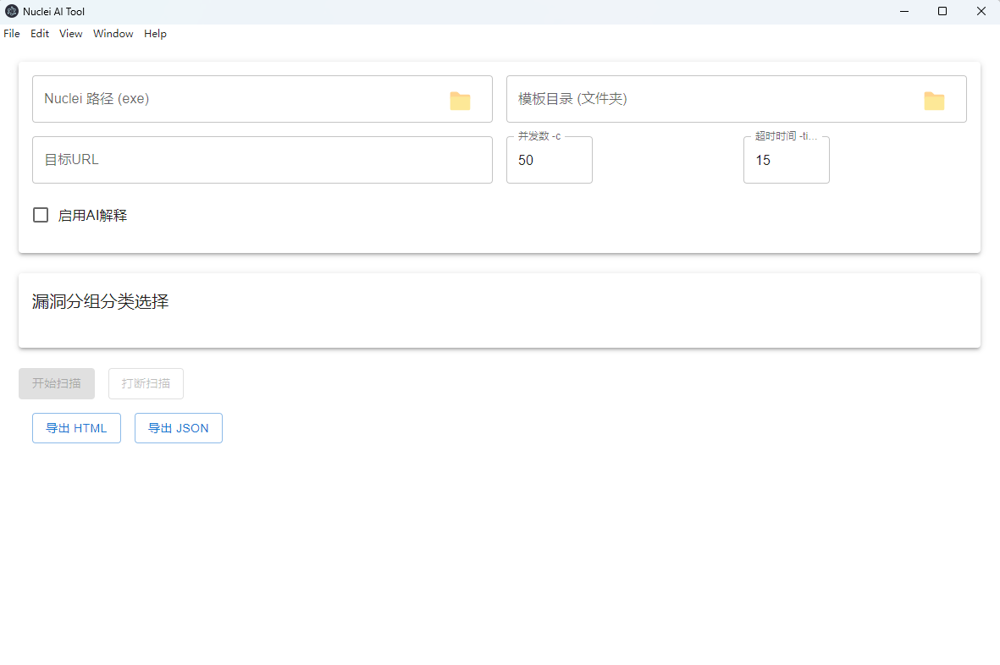
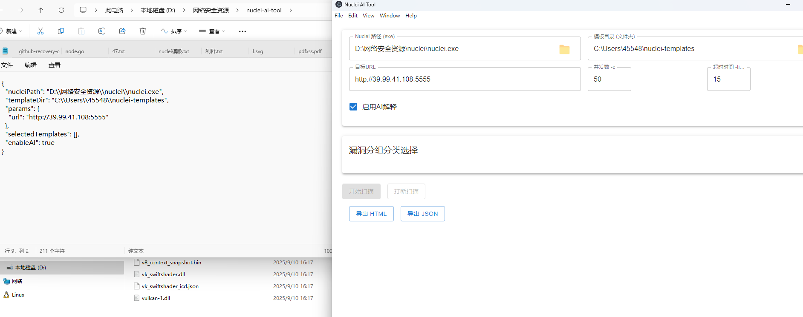
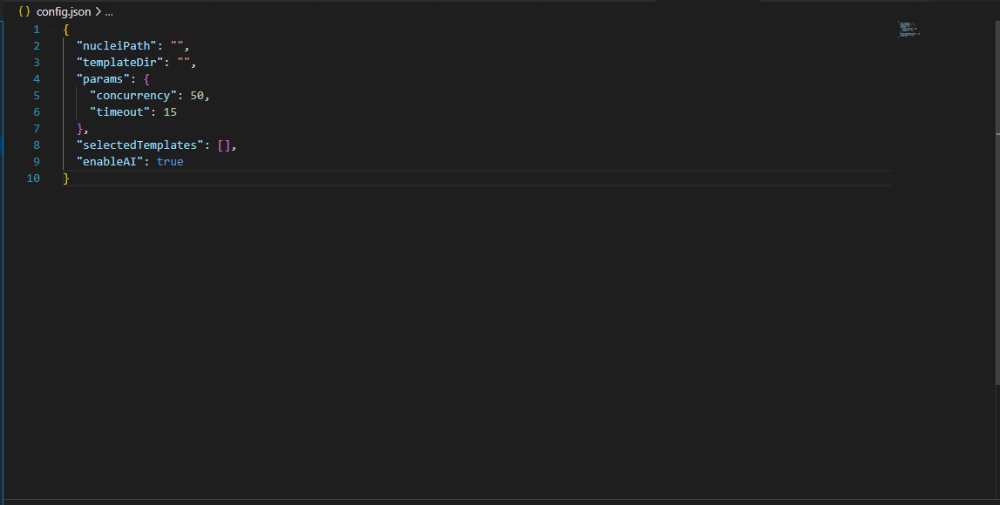
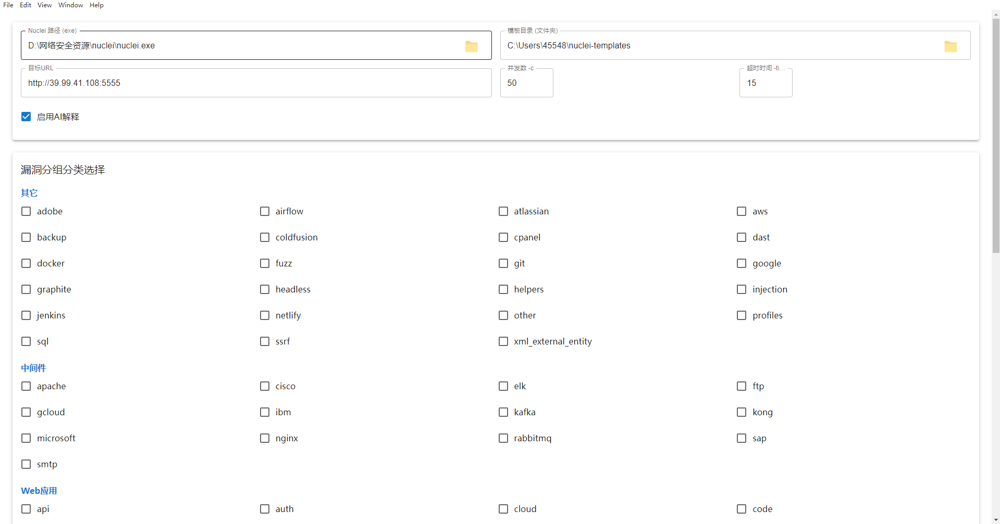
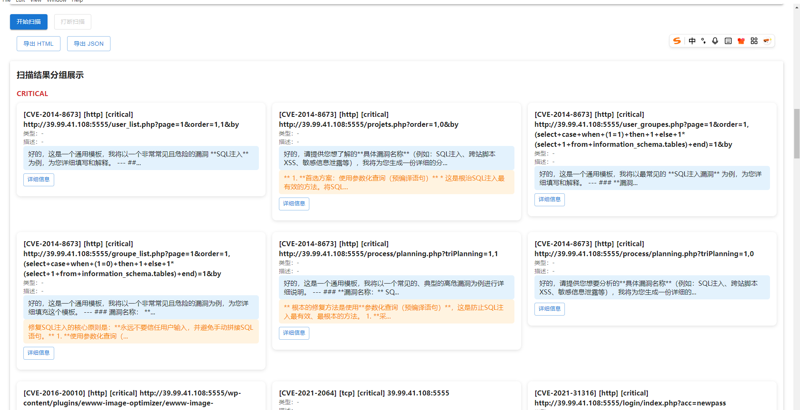
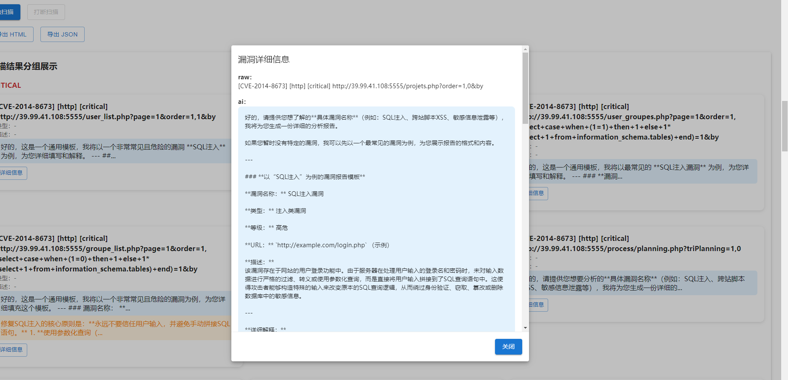

# Nuclei AI Tool

轻量化、可迁移的 nuclei + AI 扫描工具  
基于 Electron + React UI，Node.js 后端

---

## 功能简介

- 配置 nuclei 路径和模板目录，自动保存和加载
- nuclei 命令行参数可视化配置
- 自动解析模板分类，支持多选扫描
- 扫描结果分组展示（严重程度、类型等）
- 集成 DeepSeek/OpenAI API，自动解释漏洞、修复建议
- 扫描结果导出为 HTML/JSON
- 配置加密本地存储
- Windows 单文件 EXE，无需安装依赖

---

## 快速使用

1. 安装依赖  
   `npm install`
2. 开发启动  
   `npm start`
3. 打包 EXE  
   `npm run build`  
   或  
   `npx electron-builder --win --x64 --dir`

---

## 目录结构

- `src/main`      Electron 主进程
- `src/renderer`  React 前端
- `src/backend`   Node.js 后端服务
- `src/common`    公共工具/类型
- `public`        静态资源
- `dist`          打包输出（EXE、依赖等）

---

## 依赖说明

- Electron
- React + MUI
- electron-store
- axios
- electron-builder
- framer-motion

---

## 配置与使用说明

- **AI API 配置**  
  在 `src/backend/backend.js` 中配置 AI API KEY 和接口 URL（如 DeepSeek/OpenAI）。
- **config.json 文件**  
  默认保存于 EXE 同目录下。首次启动时填写路径，config.json 会自动生成，后续自动读取。
- **模板分组展示**  
  填写模板目录后，config.json文件生成后重启，方能自动读取下方一级文件夹并分组展示。
- **AI功能说明**  
  未开启 AI 时，仅整理 nuclei 扫描结果。开启后，会自动请求 AI 接口，生成漏洞解释和修复建议。

---

## 迁移/部署

- 仅需 EXE 文件，无需安装 Node.js 或其他依赖
- 配置数据本地加密存储，安全可靠

---

## 常见问题

- 首次启动填写路径后，分组会自动刷新，无需重启
- 模板目录下需有一级文件夹（如 web、cve 等），每个文件夹下需有 .yaml 模板文件
- AI API KEY 需自行配置，接口需可用

---

## 项目演示

> 以下为 Nuclei AI Tool 应用界面截图与功能演示：

### 默认界面演示

### 信息填充结束后自动生成的 config 信息

### config.js 格式

### 重启后的模版文件扫描结果

### AI 扫描结果展示

### AI 详情展示

> 更多演示与说明请见项目文档或 issue 区。